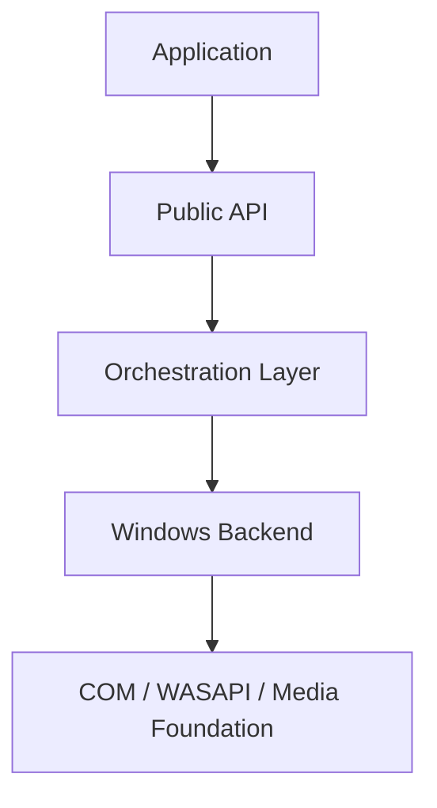

Sonotide is strictly layered. This intentional design prevents the public API from leaking internal Windows complexities, while keeping the core robust and testable.

<Frame>

</Frame>

## 1. The Public API Layer

This is everything your application compiles against:
- The `runtime` singleton.
- Stream facades (`render_stream`, `capture_stream`).
- Type-safe models (Devices, Formats, Errors, Status).
- The `playback_session` and `equalizer_state`.

**Crucially, this layer requires zero knowledge of COM headers.**

## 2. The Orchestration Layer

Sitting in the middle, the orchestration layer acts as the brain of the framework:
- It manages worker threads.
- Controls state machine transitions (`open`, `start`, `stop`).
- Safely handles callback dispatch to the application.
- Translates messy `HRESULT` codes into clean Sonotide `error` structures.

## 3. The Windows Backend

The basement of the framework does the heavy lifting:
- Bootstraps COM apartments safely.
- Interacts with raw Windows endpoints to enumerate devices.
- Activates `IAudioClient` and pushes raw packet flows.
- Leverages **Media Foundation** for decoding sources during a playback session.

---

## Threading Contract

Sonotide is highly predictable when it comes to threads. You control the synchronization:

<CardGroup cols={2}>
  <Card title="open_*_stream" icon="folder-open">
    Prepares the stream and allocates backend resources. Does NOT spawn active listeners.
  </Card>
  <Card title="start" icon="play">
    Synchronously waits for the worker thread to initialize. If it returns success, audio is flowing.
  </Card>
  <Card title="stop" icon="stop">
    Issues a halt command and waits for the worker thread to gracefully finish.
  </Card>
  <Card title="close" icon="xmark">
    Terminal and idempotent cleanup.
  </Card>
</CardGroup>

<Warning>
  You are responsible for keeping the provided **callback object** alive for the entire duration of the stream's lifecycle. If the stream outlives the callback, memory corruption will occur.
</Warning>
