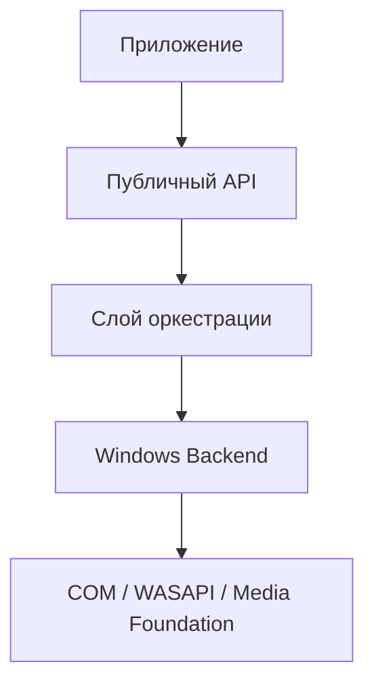

Архитектура Sonotide имеет строгую слоистую структуру. Это сделано намеренно, чтобы не допустить "утечки" сложной логики Windows в публичный API и сделать тестирование простым и предсказуемым.

<Frame>

</Frame>

## 1. Публичный API (Public Layer)

Этот слой содержит всё то, с чем работает разработчик приложения:
- Точка входа `runtime`.
- Фасады потоков (`render_stream`, `capture_stream`).
- Строго типизированные модели конфигураций, форматов и ошибок.
- Настройки `playback_session` и `equalizer_state`.

**Важное преимущество:** вам не нужно подключать заголовочные файлы COM, чтобы работать с API Sonotide.

## 2. Слой оркестрации (Orchestration)

Этот слой является мозгом фреймворка:
- Управляет фоновыми потоками.
- Контролирует машину состояний (`open`, `start`, `stop`).
- Безопасно передаёт данные в пользовательский коллбек.
- Конвертирует системные коды `HRESULT` в удобные C++ структуры `error`.

## 3. Windows Backend

Грязная, платформозависимая работа остаётся в подвале библиотеки:
- Инициализация COM.
- Поиск аудио-endpoint'ов системы.
- Работа с внутренностями `IAudioClient` и передача пакетов по событиям.
- Использование подсистемы **Media Foundation** для декодирования аудио при воспроизведении.

---

## Потокобезопасность и жизненный цикл

Поведение методов фреймворка строго регламентировано:

<CardGroup cols={2}>
  <Card title="open_*_stream" icon="folder-open">
    Подготавливает системные ресурсы, но не запускает передачу аудио.
  </Card>
  <Card title="start" icon="play">
    Синхронно дожидается успешного старта фонового потока.
  </Card>
  <Card title="stop" icon="stop">
    Посылает сигнал остановки и блокирует выполнение до завершения работы worker-потока.
  </Card>
  <Card title="close" icon="xmark">
    Финальная очистка ресурсов. Вызов безопасен при повторном использовании.
  </Card>
</CardGroup>

<Warning>
  Вы (разработчик приложения) несете ответственность за то, чтобы **объект коллбека** жил дольше, чем сам поток. Если объект удалится во время воспроизведения, произойдет обращение к освобожденной памяти.
</Warning>
